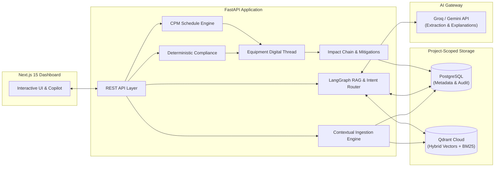

# Project Atlas 🚀

**Evidence-backed EPC project intelligence connecting requirements to equipment, delivery, schedule, commissioning evidence, and human decision.**

[](https://hackathon.example.com)
[](https://nextjs.org)
[](https://fastapi.tiangolo.com)
[](https://python.org)
[](https://qdrant.tech)
[](https://groq.com)

---

## 🌐 Live Deployment & Resources

| Resource | Live URL | Description |
| :--- | :--- | :--- |
| **Frontend Dashboard** | **[https://project-atlas.netlify.app](https://project-atlas.netlify.app)** | Live Next.js dashboard (*Note: update subdomain if customized on Netlify*) |
| **Backend API (Swagger)** | **[https://project-atlas-rd7v.onrender.com/docs](https://project-atlas-rd7v.onrender.com/docs)** | Live FastAPI interactive documentation and OpenAPI schema |
| **Backend Health Check** | **[https://project-atlas-rd7v.onrender.com/health](https://project-atlas-rd7v.onrender.com/health)** | Liveness and readiness endpoint checking Qdrant & Database status |
| **Architecture Guide** | **[docs/ARCHITECTURE.md](docs/ARCHITECTURE.md)** | Deep-dive into data models, vector schemas, and AI workflows |
| **3-Minute Walkthrough** | **[docs/DEMO_SCRIPT.md](docs/DEMO_SCRIPT.md)** | Step-by-step presentation script for hackathon judges |

---

## 💡 Problem & Motivation

Engineering, Procurement, and Construction (EPC) projects suffer from massive fragmentation. Specifications, vendor submittals, RFIs, delivery logistics, schedules, and commissioning test records live in disconnected silos. 

When a vendor submits equipment with a subtle technical deviation (e.g., lower short-circuit rating), traditional tools miss how that single gap cascades across the project lifecycle:
* **Procurement:** Vendor must revise submittals (`+lead time`).
* **Schedule:** Delivery delay consumes critical path float (`+schedule slip`).
* **Commissioning:** Site engineers lack pre-test readiness visibility (`+on-site rework`).

**Atlas solves this by creating an inspectable, deterministic, evidence-backed digital thread across the entire EPC lifecycle.**

---

## ⚡ Core Innovation: Equipment Digital Thread & Impact Chain

Atlas connects all project dimensions to individual equipment tags (e.g., `SWGR-A`, `UPS-A`). Instead of relying on unverified LLM guesses, Atlas links verified events through a strict **Impact Chain**:

```
Specification Deviation → Vendor Resubmission → Delivery Risk → Schedule Impact → Commissioning Readiness → Human Approval
```

### Key Architectural Principles:
1. **Deterministic Calculations First:** Critical path method (CPM) schedule impacts, unit conversions, float consumption, and commissioning readiness (`% coverage`) are calculated entirely using deterministic Python engines.
2. **AI for Extraction & Grounding Only:** Groq and Google Gemini power structured extraction, intent routing, and natural-language explanations grounded strictly in retrieved project evidence (`[C1]`, `[C2]`).
3. **Strict Human-in-the-Loop Authority:** AI never mutates project status automatically. Mitigations and schedule recoveries are proposed as counterfactual scenarios requiring human engineering sign-off (`APPROVE` / `REJECT` / `REQUEST_REVIEW`).
4. **Absolute Project Isolation:** All PostgreSQL entities and Qdrant vector points are strictly tenant-isolated by `project_id`.

---

## 🏗️ System Architecture & Workflow



### Advanced Hybrid RAG Pipeline
For queries and RFI matches, Atlas uses a multi-stage RAG pipeline that prioritizes precision and safety:
1. **Query Rewrite & Intent Routing:** Resolves conversation history and routes requests (e.g., `knowledge_query`, `compliance_query`, `schedule_analysis`).
2. **Hybrid Retrieval:** Combines dense semantic embeddings with sparse lexical scoring (BM25) via **Reciprocal Rank Fusion (RRF)** across project-scoped document chunks.
3. **Cross-Encoder Reranking & Context Expansion:** Reranks candidate chunks and expands child chunks to full section contexts (`parent_expand`) without exceeding token budgets.
4. **Evidence Sufficiency Gate:** Refuses to answer (`INSUFFICIENT_EVIDENCE`) if retrieved chunks lack factual grounding for the user's prompt.

---

## 📊 Evaluation & Verification Metrics

Atlas includes an extensive synthetic evaluation suite ([`evaluation/latest.md`](evaluation/latest.md)) and pre-built benchmarks ensuring high reliability:

| Module | Verification Evidence & Metrics |
| :--- | :--- |
| **Compliance & Unit Normalization** | **1.0 Precision / 1.0 Recall / 1.0 F1** across 12 labeled synthetic outcomes (`6 TP, 0 FP, 0 FN, 6 TN`). |
| **Advanced RAG Accuracy** | **Recall@12: 1.0, MRR: 1.0, Unsupported Claim Rate: 0.0**. Strictly refuses ungrounded assumptions. |
| **CPM Schedule Engine** | **0-day error** on planted `35-day` SWGR-A delay scenario with full float and critical path recalculation. |
| **Commissioning QA** | **21/21 steps** automatically verified with deterministic pass/fail rules and open non-conformance (`NCR`) tracking. |
| **Supply Chain Visibility** | **5/5 synthetic shipments** across 15 supplier tiers tracked with schedule task links and alternative supplier recovery options. |

---

## 🚀 Quick Start Guide

### 1. Prerequisites
* **Python 3.11+** and **Node.js 20+**
* **Docker Compose** (optional, for local PostgreSQL/Qdrant)
* **Groq API Key** (`GROQ_API_KEY`) or **Gemini API Key** (`GEMINI_API_KEY`)

### 2. Local Setup & Demo Seeding
```bash
# Clone the repository and configure environment variables
git clone https://github.com/Prabhav200511/project-Atlas.git
cd project-Atlas
cp .env.example .env

# Add your AI key in .env
# GROQ_API_KEY=gsk_your_api_key_here

# Run the automated demo setup (seeds documents, shipments, and SWGR-A impact chain)
./scripts/start_demo.sh
```

Once running locally:
* **Frontend Dashboard:** [http://localhost:3000](http://localhost:3000)
* **Backend API Docs:** [http://localhost:8001/docs](http://localhost:8001/docs)

### 3. Running the Test Suite
Atlas maintains strict quality guarantees verified via comprehensive automated tests:
```bash
# Run backend unit, integration, and RAG workflow tests
python -m pytest -v

# Run frontend typechecking and build validation
cd frontend && npm run check
```

---

## ⚙️ Environment Variables Matrix

| Variable | Description | Target / Default |
| :--- | :--- | :--- |
| `DATABASE_URL` | PostgreSQL connection string | Supabase / Local PostgreSQL |
| `QDRANT_URL` | Qdrant Vector DB instance URL | Qdrant Cloud / `http://localhost:6333` |
| `QDRANT_API_KEY` | Authentication key for Qdrant | Required for Qdrant Cloud |
| `GROQ_API_KEY` | Primary fast AI provider key | Groq API (`gsk_...`) |
| `GEMINI_API_KEY` | Fallback AI provider key | Google GenAI API |
| `FAST_RERANK` | Enable instant lexical scoring | `1` (enabled by default for cloud free-tier) |
| `NEXT_PUBLIC_API_URL` | Backend URL for Next.js client | `https://project-atlas-rd7v.onrender.com` |

---

## 📁 Repository Structure

```text
├── app/                  # FastAPI core application, REST routes, models, and workflows
├── frontend/             # Next.js 15 dashboard, Tailwind CSS components, and typed API client
├── data/synthetic_epc/   # Curated synthetic EPC project documents, schedules, and specifications
├── docs/                 # Architecture overview, demo walkthrough scripts, and technical notes
├── evaluation/           # Reproducible synthetic RAG and compliance evaluation benchmarks
├── migrations/           # Alembic database schema migration history
├── scripts/              # Demo seeding, re-indexing, evaluation, and production boot scripts
└── tests/                # Full pytest suite covering isolated project tenancy and RAG accuracy
```

---

## 📜 License & Provenance
All synthetic documents, drawings, and scenarios in `data/synthetic_epc/` are fictional and created specifically for demonstration and benchmark testing. See [`docs/LICENSES.md`](docs/LICENSES.md) for open-source dependency licenses.
